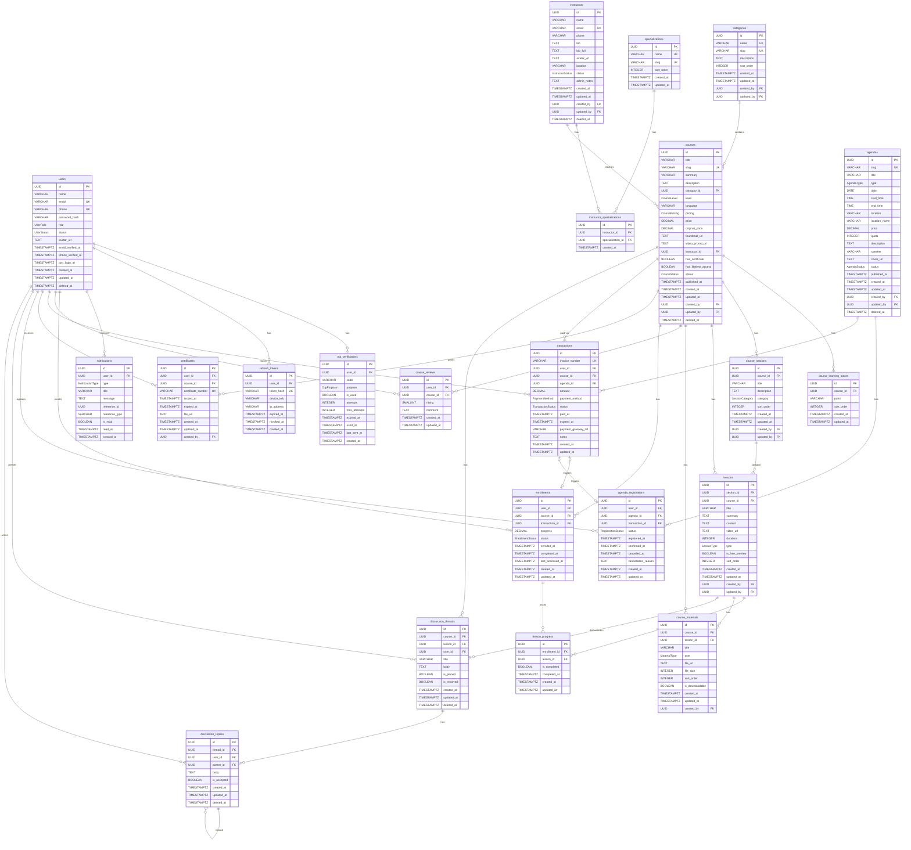

# Database Schema Design

## Marbot LMS — Database Structure

---

## Conventions

- **Primary Key**: UUID v4, kolom `id`
- **Timestamps**: Semua tabel memiliki `created_at` dan `updated_at`
- **Audit Trail**: Tabel yang memerlukan tracking perubahan memiliki `created_by` dan `updated_by` (FK ke `users.id`, nullable)
- **Soft Delete**: Tabel utama menggunakan `deleted_at` (nullable) untuk soft delete
- **Enum Values**: Menggunakan bahasa Inggris, UPPER_SNAKE_CASE
- **Naming**: snake_case untuk semua kolom dan tabel
- **Foreign Key**: Format `{entity}_id`
- **No Denormalized Counts**: Field count/total tidak disimpan di tabel, dihitung via query (`COUNT()`) atau cached di application layer
- **Video Storage**: Video kursus disimpan sebagai YouTube private/unlisted link. Tidak perlu self-hosting video karena YouTube sudah menyediakan adaptive streaming, CDN global, dan player yang reliable. Field `video_url` menyimpan full YouTube URL (misal `https://www.youtube.com/watch?v=xxx`)

---

## Enum Definitions

### UserRole

| Value | Deskripsi | Kapan Digunakan | Cara Pengisian |
|-------|-----------|-----------------|----------------|
| `ADMIN` | Administrator platform | Diberikan manual oleh super admin atau saat seeding data awal | Set via admin panel atau langsung di database |
| `STUDENT` | Peserta/pelajar | Default saat user baru mendaftar | Otomatis di-set saat registrasi (DEFAULT) |

### UserStatus

| Value | Deskripsi | Kapan Digunakan | Cara Pengisian |
|-------|-----------|-----------------|----------------|
| `ACTIVE` | Akun aktif | Default saat registrasi berhasil | Otomatis (DEFAULT) |
| `INACTIVE` | Akun nonaktif | User menonaktifkan akun sendiri, atau admin menonaktifkan | Di-set via profil user atau admin panel |
| `SUSPENDED` | Akun ditangguhkan | Admin memblokir user karena pelanggaran | Di-set oleh admin melalui admin panel |

### InstructorStatus

| Value | Deskripsi | Kapan Digunakan | Cara Pengisian |
|-------|-----------|-----------------|----------------|
| `ACTIVE` | Pengajar aktif, profil dan kursus tampil publik | Default saat pengajar baru ditambahkan | Otomatis (DEFAULT) |
| `INACTIVE` | Pengajar nonaktif, profil dan kursus disembunyikan | Admin menonaktifkan pengajar sementara | Admin klik "Nonaktifkan" di admin panel |

### CourseLevel

| Value | Deskripsi | Kapan Digunakan | Cara Pengisian |
|-------|-----------|-----------------|----------------|
| `BEGINNER` | Pemula — tidak perlu pengetahuan awal | Kursus dasar untuk marbot/takmir baru | Dipilih admin saat membuat/edit kursus |
| `INTERMEDIATE` | Menengah — butuh pemahaman dasar | Kursus yang membangun di atas dasar | Dipilih admin saat membuat/edit kursus |
| `ADVANCED` | Lanjut — butuh pengalaman signifikan | Kursus spesialisasi/mahir | Dipilih admin saat membuat/edit kursus |

### CourseStatus

| Value | Deskripsi | Kapan Digunakan | Cara Pengisian |
|-------|-----------|-----------------|----------------|
| `DRAFT` | Belum dipublikasikan, tidak terlihat publik | Default saat kursus baru dibuat, atau ditarik dari publik untuk revisi | Otomatis (DEFAULT) saat create. Admin bisa set manual |
| `PUBLISHED` | Sudah dipublikasikan, terlihat di katalog | Admin memutuskan kursus siap tayang | Admin klik "Publish" → set status + `published_at = NOW()` |
| `ARCHIVED` | Diarsipkan, tidak menerima enrollment baru | Kursus sudah usang tapi peserta lama masih bisa akses | Admin klik "Archive". Peserta existing tetap bisa lanjut belajar |

### CoursePricing

| Value | Deskripsi | Kapan Digunakan | Cara Pengisian |
|-------|-----------|-----------------|----------------|
| `FREE` | Kursus gratis, langsung enroll tanpa bayar | Kursus pengenalan atau materi dasar | Admin pilih saat buat kursus → `price` harus `0` |
| `PAID` | Kursus berbayar, butuh transaksi sebelum akses | Kursus premium/spesialisasi | Admin pilih saat buat kursus → `price` harus `> 0` |

### SectionCategory

| Value | Deskripsi | Kapan Digunakan | Cara Pengisian |
|-------|-----------|-----------------|----------------|
| `INTRODUCTION` | Pendahuluan — materi pembuka kursus | Section awal berisi orientasi, overview kursus | Admin pilih saat menambah section di form kursus |
| `MAIN` | Modul Utama — inti materi pembelajaran | Section utama yang merupakan konten inti kursus | Admin pilih saat menambah section |
| `SUPPLEMENTARY` | Modul Tambahan — materi pelengkap | Section berisi studi kasus, latihan tambahan, bonus material | Admin pilih saat menambah section |
| `CLOSING` | Penutup — materi penutup kursus | Section akhir berisi rangkuman, kesimpulan, atau evaluasi akhir | Admin pilih saat menambah section |

### LessonType

| Value | Deskripsi | Kapan Digunakan | Cara Pengisian |
|-------|-----------|-----------------|----------------|
| `VIDEO` | Materi video (YouTube private/unlisted) | Lesson utama berupa rekaman video pengajaran | Admin pilih type lalu isi `video_url` dengan link YouTube |
| `TEXT` | Materi teks/artikel | Lesson berupa teks bacaan, panduan tertulis, atau infografis | Admin pilih type lalu isi `content` dengan konten teks (mendukung rich text/markdown) |
| `QUIZ` | Kuis/ujian untuk evaluasi | Lesson berupa pertanyaan untuk mengukur pemahaman | Admin pilih type → konten quiz disimpan di `content` sebagai JSON structure |

### MaterialType

| Value | Deskripsi | Kapan Digunakan | Cara Pengisian |
|-------|-----------|-----------------|----------------|
| `PDF` | Dokumen PDF | Materi bacaan, e-book, handout | Admin upload file PDF → URL tersimpan di `file_url` |
| `SLIDE` | Presentasi/slide | Slide materi presentasi | Admin upload file PPT/PPTX/PDF slide |
| `DOCUMENT` | Dokumen (Word, dsb) | Template, worksheet, panduan operasional | Admin upload file DOCX/DOC |
| `SPREADSHEET` | Spreadsheet | Template anggaran, checklist, form | Admin upload file XLSX/XLS |
| `IMAGE` | Gambar | Infografis, diagram, poster | Admin upload file JPG/PNG |
| `LINK` | External link | Referensi ke website/resource eksternal | Admin isi URL di `file_url` (bukan upload) |
| `OTHER` | Lainnya | File tipe lain yang tidak masuk kategori | Admin upload file apapun |

### EnrollmentStatus

| Value | Deskripsi | Kapan Digunakan | Cara Pengisian |
|-------|-----------|-----------------|----------------|
| `ACTIVE` | Sedang berjalan, peserta masih belajar | Default saat enroll berhasil (langsung untuk FREE, setelah bayar untuk PAID) | Otomatis (DEFAULT) saat enrollment dibuat |
| `COMPLETED` | Telah selesai, semua modul diselesaikan | Semua lesson dalam kursus telah ditandai selesai (progress = 100%) | Otomatis saat progress 100% → set `completed_at = NOW()` |
| `DROPPED` | Dibatalkan oleh peserta | Peserta memutuskan berhenti dari kursus | User klik "Batal Kursus" → set status + tidak bisa re-enroll ke kursus yang sama |

### TransactionStatus

| Value | Deskripsi | Kapan Digunakan | Cara Pengisian |
|-------|-----------|-----------------|----------------|
| `PENDING` | Menunggu pembayaran dari user | Default saat checkout dibuat, menunggu user membayar | Otomatis (DEFAULT) saat transaksi dibuat |
| `SUCCESS` | Pembayaran berhasil diterima | Callback dari payment gateway mengkonfirmasi pembayaran | Otomatis via webhook payment gateway → set `paid_at = NOW()` |
| `FAILED` | Pembayaran gagal | Payment gateway melaporkan pembayaran gagal (saldo kurang, ditolak bank) | Otomatis via webhook payment gateway |
| `REFUNDED` | Dana dikembalikan ke pembeli | Admin memproses refund atas permintaan atau kebijakan | Admin memproses refund → update status |
| `EXPIRED` | Kadaluarsa, batas waktu bayar habis | User tidak membayar dalam batas waktu yang ditentukan | Otomatis via cron job yang cek `expired_at < NOW()` |

### PaymentMethod

| Value | Deskripsi | Kapan Digunakan | Cara Pengisian |
|-------|-----------|-----------------|----------------|
| `BANK_TRANSFER` | Transfer bank manual | User pilih metode pembayaran saat checkout | User pilih di halaman checkout |
| `E_WALLET` | Dompet digital (GoPay, OVO, DANA) | User pilih metode pembayaran saat checkout | User pilih di halaman checkout |
| `QRIS` | Pembayaran via scan QR code | User pilih metode pembayaran saat checkout | User pilih di halaman checkout |
| `VIRTUAL_ACCOUNT` | Virtual account bank | User pilih metode pembayaran saat checkout | User pilih di halaman checkout |

### AgendaType

| Value | Deskripsi | Kapan Digunakan | Cara Pengisian |
|-------|-----------|-----------------|----------------|
| `ONLINE` | Daring via Zoom/Google Meet | Workshop dilaksanakan secara online | Admin pilih saat membuat agenda → `location` bisa berisi link meeting |
| `OFFLINE` | Luring di lokasi fisik | Workshop dilaksanakan di tempat tertentu | Admin pilih saat membuat agenda → isi `location` + `location_name` |
| `HYBRID` | Campuran online + offline | Workshop bisa diikuti online dan offline | Admin pilih saat membuat agenda → isi lokasi fisik + link meeting |

### AgendaStatus

| Value | Deskripsi | Kapan Digunakan | Cara Pengisian |
|-------|-----------|-----------------|----------------|
| `DRAFT` | Belum dipublikasikan | Default saat agenda baru dibuat | Otomatis (DEFAULT) |
| `PUBLISHED` | Sudah dipublikasikan, terbuka untuk pendaftaran | Admin memutuskan agenda siap dipublikasikan | Admin klik "Publish" → set `published_at = NOW()` |
| `CANCELLED` | Dibatalkan, tidak jadi dilaksanakan | Ada perubahan rencana, narasumber berhalangan, dsb | Admin klik "Batalkan" → peserta yang terdaftar dinotifikasi |
| `COMPLETED` | Sudah selesai dilaksanakan | Agenda telah berlangsung dan selesai | Otomatis via cron job setelah tanggal agenda berlalu, atau admin set manual |

### RegistrationStatus

| Value | Deskripsi | Kapan Digunakan | Cara Pengisian |
|-------|-----------|-----------------|----------------|
| `PENDING` | Menunggu konfirmasi/pembayaran | Default saat user mendaftar agenda berbayar | Otomatis (DEFAULT) saat pendaftaran |
| `CONFIRMED` | Terkonfirmasi, peserta diterima | Pembayaran berhasil (berbayar) atau langsung (gratis) | Otomatis setelah pembayaran sukses, atau langsung untuk agenda gratis |
| `CANCELLED` | Dibatalkan oleh peserta atau admin | Peserta membatalkan, atau agenda dibatalkan | Set oleh user/admin → isi `cancelled_at` + `cancellation_reason` |
| `ATTENDED` | Hadir pada hari pelaksanaan | Peserta hadir di acara (absensi) | Admin menandai kehadiran di admin panel setelah acara |

### OtpPurpose

| Value | Deskripsi | Kapan Digunakan | Cara Pengisian |
|-------|-----------|-----------------|----------------|
| `EMAIL_VERIFICATION` | Verifikasi email saat registrasi | User baru mendaftar dan perlu verifikasi email | Otomatis dibuat saat registrasi → OTP dikirim ke email |
| `PHONE_VERIFICATION` | Verifikasi nomor telepon | User menambahkan/mengubah nomor telepon | Otomatis dibuat saat update telepon → OTP dikirim via SMS |
| `PASSWORD_RESET` | Reset password yang terlupa | User klik "Lupa Password" | Otomatis dibuat saat request reset → OTP dikirim ke email/SMS |

### NotificationType

| Value | Deskripsi | Kapan Digunakan | Cara Pengisian |
|-------|-----------|-----------------|----------------|
| `ENROLLMENT_SUCCESS` | Berhasil enroll kursus | Setelah enroll kursus (free) atau pembayaran berhasil (paid) | Otomatis saat enrollment dibuat |
| `COURSE_COMPLETED` | Kursus telah diselesaikan | Progress enrollment mencapai 100% | Otomatis saat enrollment status → COMPLETED |
| `CERTIFICATE_ISSUED` | Sertifikat diterbitkan | Sertifikat dibuat setelah kursus selesai | Otomatis saat certificate dibuat |
| `AGENDA_REMINDER` | Pengingat agenda akan dimulai | H-1 atau H-hari acara | Otomatis via cron job |
| `AGENDA_CANCELLED` | Agenda dibatalkan | Admin membatalkan agenda | Otomatis saat agenda status → CANCELLED |
| `PAYMENT_SUCCESS` | Pembayaran berhasil | Webhook payment gateway mengkonfirmasi | Otomatis saat transaction status → SUCCESS |
| `PAYMENT_EXPIRED` | Pembayaran kadaluarsa | Batas waktu bayar habis | Otomatis saat transaction status → EXPIRED |
| `DISCUSSION_REPLY` | Ada balasan di diskusi | Seseorang membalas thread yang user buat | Otomatis saat discussion_reply dibuat |
| `SYSTEM` | Notifikasi umum dari sistem | Pengumuman platform, maintenance, dsb | Dibuat manual oleh admin |

---

## Tables

### 1. `users`

Menyimpan data semua pengguna platform (admin & student).

| Column | Type | Constraints | Deskripsi |
|--------|------|-------------|-----------|
| `id` | `UUID` | PK, DEFAULT uuid_generate_v4() | Primary key |
| `name` | `VARCHAR(255)` | NOT NULL | Nama lengkap |
| `email` | `VARCHAR(255)` | NOT NULL, UNIQUE | Alamat email |
| `phone` | `VARCHAR(20)` | UNIQUE, NULLABLE | Nomor telepon |
| `password_hash` | `VARCHAR(255)` | NOT NULL | Bcrypt hash password |
| `role` | `UserRole` | NOT NULL, DEFAULT 'STUDENT' | Role pengguna |
| `status` | `UserStatus` | NOT NULL, DEFAULT 'ACTIVE' | Status akun |
| `avatar_url` | `TEXT` | NULLABLE | URL foto profil |
| `email_verified_at` | `TIMESTAMPTZ` | NULLABLE | Waktu verifikasi email |
| `phone_verified_at` | `TIMESTAMPTZ` | NULLABLE | Waktu verifikasi telepon |
| `last_login_at` | `TIMESTAMPTZ` | NULLABLE | Login terakhir |
| `created_at` | `TIMESTAMPTZ` | NOT NULL, DEFAULT NOW() | Waktu dibuat |
| `updated_at` | `TIMESTAMPTZ` | NOT NULL, DEFAULT NOW() | Waktu terakhir diubah |
| `deleted_at` | `TIMESTAMPTZ` | NULLABLE | Soft delete |

**Indexes:**
- `idx_users_email` — UNIQUE on `email`
- `idx_users_phone` — UNIQUE on `phone`
- `idx_users_role` — on `role`
- `idx_users_status` — on `status`

---

### 2. `otp_verifications`

Menyimpan kode OTP untuk verifikasi email/telepon dan reset password.

| Column | Type | Constraints | Deskripsi |
|--------|------|-------------|-----------|
| `id` | `UUID` | PK, DEFAULT uuid_generate_v4() | Primary key |
| `user_id` | `UUID` | FK → users.id, NOT NULL, ON DELETE CASCADE | Pemilik OTP |
| `code` | `VARCHAR(6)` | NOT NULL | Kode OTP |
| `purpose` | `OtpPurpose` | NOT NULL | Tujuan OTP |
| `is_used` | `BOOLEAN` | DEFAULT FALSE | Sudah digunakan |
| `attempts` | `INTEGER` | DEFAULT 0 | Jumlah percobaan input |
| `max_attempts` | `INTEGER` | DEFAULT 5 | Maksimal percobaan |
| `expired_at` | `TIMESTAMPTZ` | NOT NULL | Waktu kadaluarsa |
| `used_at` | `TIMESTAMPTZ` | NULLABLE | Waktu digunakan |
| `last_sent_at` | `TIMESTAMPTZ` | NOT NULL, DEFAULT NOW() | Waktu terakhir OTP dikirim (untuk rate limiting, misal min 60 detik antar pengiriman) |
| `created_at` | `TIMESTAMPTZ` | NOT NULL, DEFAULT NOW() | Waktu dibuat |

**Indexes:**
- `idx_otp_user_purpose` — on (`user_id`, `purpose`)
- `idx_otp_expired_at` — on `expired_at`

> **Rate Limiting**: Sebelum membuat OTP baru, cek `last_sent_at` dari OTP terakhir user dengan purpose yang sama. Jika `NOW() - last_sent_at < 60 detik`, tolak request. Ini mencegah spam OTP.

---

### 3. `refresh_tokens`

Menyimpan refresh token untuk JWT authentication dan session management.

| Column | Type | Constraints | Deskripsi |
|--------|------|-------------|-----------|
| `id` | `UUID` | PK, DEFAULT uuid_generate_v4() | Primary key |
| `user_id` | `UUID` | FK → users.id, NOT NULL, ON DELETE CASCADE | Pemilik token |
| `token_hash` | `VARCHAR(255)` | NOT NULL, UNIQUE | Hash dari refresh token (SHA-256) |
| `device_info` | `VARCHAR(500)` | NULLABLE | Informasi device/browser (User-Agent) |
| `ip_address` | `VARCHAR(45)` | NULLABLE | IP address saat token dibuat |
| `expired_at` | `TIMESTAMPTZ` | NOT NULL | Waktu kadaluarsa token |
| `revoked_at` | `TIMESTAMPTZ` | NULLABLE | Waktu token di-revoke (NULL = aktif) |
| `created_at` | `TIMESTAMPTZ` | NOT NULL, DEFAULT NOW() | Waktu dibuat |

**Indexes:**
- `idx_refresh_tokens_token_hash` — UNIQUE on `token_hash`
- `idx_refresh_tokens_user_id` — on `user_id`
- `idx_refresh_tokens_expired_at` — on `expired_at`

> **Catatan**: Refresh token yang asli dikirim ke client, yang disimpan di database adalah hash-nya (SHA-256). Token yang sudah expired atau revoked dibersihkan secara periodik via cron job.

---

### 4. `categories`

Menyimpan kategori kursus sebagai tabel terpisah (normalisasi).

| Column | Type | Constraints | Deskripsi |
|--------|------|-------------|-----------|
| `id` | `UUID` | PK, DEFAULT uuid_generate_v4() | Primary key |
| `name` | `VARCHAR(100)` | NOT NULL, UNIQUE | Nama kategori |
| `slug` | `VARCHAR(100)` | NOT NULL, UNIQUE | URL slug |
| `description` | `TEXT` | NULLABLE | Deskripsi kategori |
| `sort_order` | `INTEGER` | DEFAULT 0 | Urutan tampilan |
| `created_at` | `TIMESTAMPTZ` | NOT NULL, DEFAULT NOW() | Waktu dibuat |
| `updated_at` | `TIMESTAMPTZ` | NOT NULL, DEFAULT NOW() | Waktu terakhir diubah |
| `created_by` | `UUID` | FK → users.id, NULLABLE | Dibuat oleh |
| `updated_by` | `UUID` | FK → users.id, NULLABLE | Diubah oleh |

**Indexes:**
- `idx_categories_slug` — UNIQUE on `slug`
- `idx_categories_sort_order` — on `sort_order`

---

### 5. `specializations`

Tabel master untuk keahlian/spesialisasi pengajar. Contoh: "Praktisi Kemasjidan", "Takmir & Manajemen Masjid", "Pengajar & Dai", "Inspirator & Pendidikan Islam".

| Column | Type | Constraints | Deskripsi |
|--------|------|-------------|-----------|
| `id` | `UUID` | PK, DEFAULT uuid_generate_v4() | Primary key |
| `name` | `VARCHAR(100)` | NOT NULL, UNIQUE | Nama keahlian (misal: "Praktisi Kemasjidan") |
| `slug` | `VARCHAR(100)` | NOT NULL, UNIQUE | URL slug |
| `sort_order` | `INTEGER` | DEFAULT 0 | Urutan tampilan |
| `created_at` | `TIMESTAMPTZ` | NOT NULL, DEFAULT NOW() | Waktu dibuat |
| `updated_at` | `TIMESTAMPTZ` | NOT NULL, DEFAULT NOW() | Waktu terakhir diubah |

**Indexes:**
- `idx_specializations_slug` — UNIQUE on `slug`
- `idx_specializations_sort_order` — on `sort_order`

---

### 6. `instructors`

Menyimpan data pengajar/narasumber kursus.

| Column | Type | Constraints | Deskripsi |
|--------|------|-------------|-----------|
| `id` | `UUID` | PK, DEFAULT uuid_generate_v4() | Primary key |
| `name` | `VARCHAR(255)` | NOT NULL | Nama lengkap & gelar |
| `email` | `VARCHAR(255)` | NULLABLE, UNIQUE | Email kontak pengajar |
| `phone` | `VARCHAR(20)` | NULLABLE | Nomor HP/WhatsApp |
| `bio` | `TEXT` | NULLABLE | Bio singkat (tagline) |
| `bio_full` | `TEXT` | NULLABLE | Bio lengkap / pengalaman |
| `avatar_url` | `TEXT` | NULLABLE | URL foto profil |
| `location` | `VARCHAR(255)` | NULLABLE | Domisili/kota |
| `status` | `InstructorStatus` | NOT NULL, DEFAULT 'ACTIVE' | Status pengajar |
| `admin_notes` | `TEXT` | NULLABLE | Catatan internal admin |
| `created_at` | `TIMESTAMPTZ` | NOT NULL, DEFAULT NOW() | Waktu dibuat |
| `updated_at` | `TIMESTAMPTZ` | NOT NULL, DEFAULT NOW() | Waktu terakhir diubah |
| `created_by` | `UUID` | FK → users.id, NULLABLE | Dibuat oleh |
| `updated_by` | `UUID` | FK → users.id, NULLABLE | Diubah oleh |
| `deleted_at` | `TIMESTAMPTZ` | NULLABLE | Soft delete |

**Indexes:**
- `idx_instructors_name` — on `name`
- `idx_instructors_email` — UNIQUE on `email`
- `idx_instructors_status` — on `status`

> **Catatan**: `rating`, `total_courses`, `total_students` dihitung via query dari tabel terkait (`course_reviews`, `courses`, `enrollments`). Spesialisasi diambil via JOIN `instructor_specializations` → `specializations`. Field `email` dan `phone` adalah data kontak publik pengajar, bukan akun login (pengajar tidak memiliki akun user di sistem).

---

### 7. `instructor_specializations`

Tabel join many-to-many antara pengajar dan keahlian. Satu pengajar bisa punya beberapa keahlian.

| Column | Type | Constraints | Deskripsi |
|--------|------|-------------|-----------|
| `id` | `UUID` | PK, DEFAULT uuid_generate_v4() | Primary key |
| `instructor_id` | `UUID` | FK → instructors.id, NOT NULL, ON DELETE CASCADE | Pengajar |
| `specialization_id` | `UUID` | FK → specializations.id, NOT NULL, ON DELETE CASCADE | Keahlian |
| `created_at` | `TIMESTAMPTZ` | NOT NULL, DEFAULT NOW() | Waktu dibuat |

**Constraints:**
- `uq_instructor_specialization` — UNIQUE on (`instructor_id`, `specialization_id`)

**Indexes:**
- `idx_instructor_spec_instructor_id` — on `instructor_id`
- `idx_instructor_spec_specialization_id` — on `specialization_id`

> **Contoh Data**:
> - Ustadz Kusnadi Ikhwani → ["Praktisi Kemasjidan"]
> - Ustadz Haidar Muhammad → ["Takmir & Manajemen Masjid"]
> - Ustadz Abdul Somad → ["Pengajar & Dai"]
> - Ustad Salim A. Fillah → ["Inspirator & Pendidikan Islam"]

---

### 8. `courses`

Menyimpan data kursus yang tersedia di platform.

| Column | Type | Constraints | Deskripsi |
|--------|------|-------------|-----------|
| `id` | `UUID` | PK, DEFAULT uuid_generate_v4() | Primary key |
| `title` | `VARCHAR(255)` | NOT NULL | Judul kursus |
| `slug` | `VARCHAR(255)` | NOT NULL, UNIQUE | URL slug |
| `summary` | `VARCHAR(500)` | NULLABLE | Ringkasan singkat kursus (ditampilkan di card) |
| `description` | `TEXT` | NULLABLE | Deskripsi lengkap kursus (mendukung rich text/markdown) |
| `category_id` | `UUID` | FK → categories.id, NOT NULL | Kategori kursus |
| `level` | `CourseLevel` | NOT NULL, DEFAULT 'BEGINNER' | Level kesulitan |
| `language` | `VARCHAR(50)` | NOT NULL, DEFAULT 'Indonesia' | Bahasa pengantar |
| `pricing` | `CoursePricing` | NOT NULL, DEFAULT 'FREE' | Tipe harga |
| `price` | `DECIMAL(12,2)` | NOT NULL, DEFAULT 0 | Harga jual (0 jika FREE) |
| `original_price` | `DECIMAL(12,2)` | NULLABLE | Harga asli sebelum diskon (ditampilkan coret). NULL = tidak ada diskon |
| `thumbnail_url` | `TEXT` | NULLABLE | URL gambar thumbnail |
| `video_promo_url` | `TEXT` | NULLABLE | URL video promosi/trailer kursus (YouTube) |
| `instructor_id` | `UUID` | FK → instructors.id, NOT NULL | Pengajar |
| `has_certificate` | `BOOLEAN` | DEFAULT FALSE | Apakah kursus menyediakan sertifikat penyelesaian |
| `has_lifetime_access` | `BOOLEAN` | DEFAULT TRUE | Akses selamanya setelah enroll |
| `status` | `CourseStatus` | NOT NULL, DEFAULT 'DRAFT' | Status publikasi |
| `published_at` | `TIMESTAMPTZ` | NULLABLE | Waktu dipublikasikan |
| `created_at` | `TIMESTAMPTZ` | NOT NULL, DEFAULT NOW() | Waktu dibuat |
| `updated_at` | `TIMESTAMPTZ` | NOT NULL, DEFAULT NOW() | Waktu terakhir diubah |
| `created_by` | `UUID` | FK → users.id, NULLABLE | Dibuat oleh |
| `updated_by` | `UUID` | FK → users.id, NULLABLE | Diubah oleh |
| `deleted_at` | `TIMESTAMPTZ` | NULLABLE | Soft delete |

**Constraints:**
- CHECK: `(pricing = 'FREE' AND price = 0) OR (pricing = 'PAID' AND price > 0)`
- CHECK: `original_price IS NULL OR original_price > price` (harga asli harus lebih besar dari harga jual)

**Indexes:**
- `idx_courses_slug` — UNIQUE on `slug`
- `idx_courses_category_id` — on `category_id`
- `idx_courses_level` — on `level`
- `idx_courses_status` — on `status`
- `idx_courses_instructor_id` — on `instructor_id`
- `idx_courses_pricing` — on `pricing`

> **Catatan**: `duration`, `sections_count`, `lessons_count`, `students_count`, `rating` dihitung via query dari tabel terkait. Info sidebar "Termasuk Dalam Kursus" (total jam, jumlah modul, sertifikat, akses) dikomposisi dari computed fields + boolean flags (`has_certificate`, `has_lifetime_access`).

---

### 9. `course_learning_points`

Menyimpan poin-poin "Apa yang akan Anda pelajari?" pada halaman detail kursus.

| Column | Type | Constraints | Deskripsi |
|--------|------|-------------|-----------|
| `id` | `UUID` | PK, DEFAULT uuid_generate_v4() | Primary key |
| `course_id` | `UUID` | FK → courses.id, NOT NULL, ON DELETE CASCADE | Kursus terkait |
| `point` | `VARCHAR(500)` | NOT NULL | Teks poin pembelajaran (misal: "Standard Operating Procedure (SOP) harian masjid") |
| `sort_order` | `INTEGER` | DEFAULT 0 | Urutan tampilan |
| `created_at` | `TIMESTAMPTZ` | NOT NULL, DEFAULT NOW() | Waktu dibuat |
| `updated_at` | `TIMESTAMPTZ` | NOT NULL, DEFAULT NOW() | Waktu terakhir diubah |

**Indexes:**
- `idx_course_learning_points_course_id` — on `course_id`

---

### 10. `course_sections`

Menyimpan section/kelompok modul dalam sebuah kursus. Setiap section mengelompokkan beberapa lesson. Contoh: "Pendahuluan", "Modul Utama: Kebersihan Area Utama", "Modul Tambahan: Studi Kasus".

| Column | Type | Constraints | Deskripsi |
|--------|------|-------------|-----------|
| `id` | `UUID` | PK, DEFAULT uuid_generate_v4() | Primary key |
| `course_id` | `UUID` | FK → courses.id, NOT NULL, ON DELETE CASCADE | Kursus terkait |
| `title` | `VARCHAR(255)` | NOT NULL | Judul section (misal: "Kebersihan Area Utama") |
| `description` | `TEXT` | NULLABLE | Deskripsi ringkas tentang section ini |
| `category` | `SectionCategory` | NOT NULL, DEFAULT 'MAIN' | Kategori section |
| `sort_order` | `INTEGER` | NOT NULL, DEFAULT 0 | Urutan tampilan section |
| `created_at` | `TIMESTAMPTZ` | NOT NULL, DEFAULT NOW() | Waktu dibuat |
| `updated_at` | `TIMESTAMPTZ` | NOT NULL, DEFAULT NOW() | Waktu terakhir diubah |
| `created_by` | `UUID` | FK → users.id, NULLABLE | Dibuat oleh |
| `updated_by` | `UUID` | FK → users.id, NULLABLE | Diubah oleh |

**Indexes:**
- `idx_course_sections_course_id` — on `course_id`
- `idx_course_sections_sort_order` — on (`course_id`, `sort_order`)

> **Catatan**: Durasi total section dihitung via `SUM(lessons.duration) WHERE section_id = ?`.

---

### 11. `lessons`

Menyimpan materi/konten individual dalam sebuah section. Ini adalah unit terkecil yang dipelajari peserta. Sebelumnya bernama `modules`, sekarang dipecah menjadi `course_sections` → `lessons` untuk mendukung hierarki seperti pada UI kurikulum.

| Column | Type | Constraints | Deskripsi |
|--------|------|-------------|-----------|
| `id` | `UUID` | PK, DEFAULT uuid_generate_v4() | Primary key |
| `section_id` | `UUID` | FK → course_sections.id, NOT NULL, ON DELETE CASCADE | Section yang memiliki lesson ini |
| `course_id` | `UUID` | FK → courses.id, NOT NULL, ON DELETE CASCADE | Kursus (denormalized dari course_sections untuk kemudahan query) |
| `title` | `VARCHAR(255)` | NOT NULL | Judul lesson (misal: "Teknik Sapu & Pel Efisien") |
| `summary` | `TEXT` | NULLABLE | Deskripsi ringkas/sinopsis materi |
| `content` | `TEXT` | NULLABLE | Konten teks/artikel (untuk type TEXT) atau JSON quiz (untuk type QUIZ) |
| `video_url` | `TEXT` | NULLABLE | URL video YouTube private/unlisted (untuk type VIDEO) |
| `duration` | `INTEGER` | DEFAULT 0 | Durasi dalam menit |
| `type` | `LessonType` | NOT NULL, DEFAULT 'VIDEO' | Tipe materi |
| `is_free_preview` | `BOOLEAN` | DEFAULT FALSE | Bisa diakses gratis sebagai preview (walaupun kursus berbayar) |
| `sort_order` | `INTEGER` | NOT NULL, DEFAULT 0 | Urutan lesson dalam section |
| `created_at` | `TIMESTAMPTZ` | NOT NULL, DEFAULT NOW() | Waktu dibuat |
| `updated_at` | `TIMESTAMPTZ` | NOT NULL, DEFAULT NOW() | Waktu terakhir diubah |
| `created_by` | `UUID` | FK → users.id, NULLABLE | Dibuat oleh |
| `updated_by` | `UUID` | FK → users.id, NULLABLE | Diubah oleh |

**Constraints:**
- CHECK: `(type = 'VIDEO' AND video_url IS NOT NULL) OR (type != 'VIDEO')` — video wajib punya URL
- CHECK: `duration >= 0`

> **Peringatan Denormalisasi**: `course_id` di lessons adalah denormalisasi dari `course_sections.course_id`. Pastikan di application layer bahwa saat membuat/memindah lesson, `course_id` selalu konsisten dengan `course_sections.course_id` milik section yang bersangkutan. Alternatif: gunakan database trigger yang otomatis meng-set `lessons.course_id = course_sections.course_id` pada INSERT/UPDATE.

**Indexes:**
- `idx_lessons_section_id` — on `section_id`
- `idx_lessons_course_id` — on `course_id`
- `idx_lessons_sort_order` — on (`section_id`, `sort_order`)
- `idx_lessons_type` — on `type`

> **Mengapa YouTube Private Link?**
> - Tidak perlu infrastruktur video hosting sendiri (hemat biaya server & bandwidth)
> - YouTube menyediakan adaptive bitrate streaming otomatis (240p–1080p sesuai koneksi user)
> - CDN global YouTube memastikan loading cepat di seluruh Indonesia
> - Admin cukup upload video ke YouTube channel Marbot LMS (set sebagai "Unlisted"), lalu paste URL-nya
> - Jika ke depan butuh DRM atau proteksi lebih ketat, bisa migrasi ke Vimeo Pro atau platform video lain tanpa mengubah schema (tetap URL)

---

### 12. `course_materials`

Menyimpan materi pendukung (file lampiran/resource) per lesson. Setiap lesson bisa memiliki beberapa materi pendukung.

| Column | Type | Constraints | Deskripsi |
|--------|------|-------------|-----------|
| `id` | `UUID` | PK, DEFAULT uuid_generate_v4() | Primary key |
| `course_id` | `UUID` | FK → courses.id, NOT NULL, ON DELETE CASCADE | Kursus terkait (denormalized untuk kemudahan query) |
| `lesson_id` | `UUID` | FK → lessons.id, NOT NULL, ON DELETE CASCADE | Lesson terkait |
| `title` | `VARCHAR(255)` | NOT NULL | Nama/judul file |
| `type` | `MaterialType` | NOT NULL | Tipe materi |
| `file_url` | `TEXT` | NOT NULL | URL file yang diupload atau external link |
| `file_size` | `INTEGER` | NULLABLE | Ukuran file dalam bytes (NULL untuk type LINK) |
| `sort_order` | `INTEGER` | DEFAULT 0 | Urutan tampilan |
| `is_downloadable` | `BOOLEAN` | DEFAULT TRUE | Bisa didownload peserta |
| `created_at` | `TIMESTAMPTZ` | NOT NULL, DEFAULT NOW() | Waktu dibuat |
| `updated_at` | `TIMESTAMPTZ` | NOT NULL, DEFAULT NOW() | Waktu terakhir diubah |
| `created_by` | `UUID` | FK → users.id, NULLABLE | Diupload oleh |

**Indexes:**
- `idx_course_materials_course_id` — on `course_id`
- `idx_course_materials_lesson_id` — on `lesson_id`

---

### 13. `course_reviews`

Menyimpan review dan rating peserta terhadap kursus.

| Column | Type | Constraints | Deskripsi |
|--------|------|-------------|-----------|
| `id` | `UUID` | PK, DEFAULT uuid_generate_v4() | Primary key |
| `user_id` | `UUID` | FK → users.id, NOT NULL | Peserta yang memberikan review |
| `course_id` | `UUID` | FK → courses.id, NOT NULL, ON DELETE CASCADE | Kursus yang direview |
| `rating` | `SMALLINT` | NOT NULL, CHECK (1-5) | Rating (1-5 bintang) |
| `comment` | `TEXT` | NULLABLE | Komentar review |
| `created_at` | `TIMESTAMPTZ` | NOT NULL, DEFAULT NOW() | Waktu dibuat |
| `updated_at` | `TIMESTAMPTZ` | NOT NULL, DEFAULT NOW() | Waktu terakhir diubah |

**Constraints:**
- `uq_course_reviews_user_course` — UNIQUE on (`user_id`, `course_id`)

**Indexes:**
- `idx_course_reviews_course_id` — on `course_id`
- `idx_course_reviews_user_id` — on `user_id`
- `idx_course_reviews_rating` — on `rating`

> **Catatan**: Rata-rata rating kursus dihitung via `AVG(rating)` dari tabel ini. Rating instructor dihitung via `AVG` dari semua kursus miliknya.

---

### 14. `enrollments`

Menyimpan data pendaftaran peserta ke kursus.

| Column | Type | Constraints | Deskripsi |
|--------|------|-------------|-----------|
| `id` | `UUID` | PK, DEFAULT uuid_generate_v4() | Primary key |
| `user_id` | `UUID` | FK → users.id, NOT NULL | Peserta |
| `course_id` | `UUID` | FK → courses.id, NOT NULL | Kursus |
| `transaction_id` | `UUID` | FK → transactions.id, NULLABLE | Transaksi pembayaran terkait (NULL untuk kursus FREE) |
| `progress` | `DECIMAL(5,2)` | DEFAULT 0.00, CHECK (0-100) | Persentase progress |
| `status` | `EnrollmentStatus` | NOT NULL, DEFAULT 'ACTIVE' | Status enrollment |
| `enrolled_at` | `TIMESTAMPTZ` | NOT NULL, DEFAULT NOW() | Tanggal enroll |
| `completed_at` | `TIMESTAMPTZ` | NULLABLE | Tanggal selesai |
| `last_accessed_at` | `TIMESTAMPTZ` | NULLABLE | Terakhir diakses |
| `created_at` | `TIMESTAMPTZ` | NOT NULL, DEFAULT NOW() | Waktu dibuat |
| `updated_at` | `TIMESTAMPTZ` | NOT NULL, DEFAULT NOW() | Waktu terakhir diubah |

**Constraints:**
- `uq_enrollments_user_course` — UNIQUE on (`user_id`, `course_id`)

**Indexes:**
- `idx_enrollments_user_id` — on `user_id`
- `idx_enrollments_course_id` — on `course_id`
- `idx_enrollments_status` — on `status`
- `idx_enrollments_transaction_id` — on `transaction_id`

> **Catatan**: `transaction_id` NULL untuk kursus FREE (langsung enroll tanpa bayar). Untuk kursus PAID, enrollment dibuat setelah transaksi berstatus `SUCCESS`.

---

### 15. `lesson_progress`

Menyimpan progress per lesson untuk setiap peserta.

| Column | Type | Constraints | Deskripsi |
|--------|------|-------------|-----------|
| `id` | `UUID` | PK, DEFAULT uuid_generate_v4() | Primary key |
| `enrollment_id` | `UUID` | FK → enrollments.id, NOT NULL, ON DELETE CASCADE | Relasi ke enrollment |
| `lesson_id` | `UUID` | FK → lessons.id, NOT NULL, ON DELETE CASCADE | Relasi ke lesson |
| `is_completed` | `BOOLEAN` | DEFAULT FALSE | Apakah sudah selesai |
| `completed_at` | `TIMESTAMPTZ` | NULLABLE | Waktu selesai |
| `created_at` | `TIMESTAMPTZ` | NOT NULL, DEFAULT NOW() | Waktu dibuat |
| `updated_at` | `TIMESTAMPTZ` | NOT NULL, DEFAULT NOW() | Waktu terakhir diubah |

**Constraints:**
- `uq_lesson_progress_enrollment_lesson` — UNIQUE on (`enrollment_id`, `lesson_id`)

**Indexes:**
- `idx_lesson_progress_enrollment_id` — on `enrollment_id`
- `idx_lesson_progress_lesson_id` — on `lesson_id`

---

### 16. `discussion_threads`

Menyimpan topik/thread diskusi per lesson. Setiap lesson memiliki ruang diskusi sendiri.

| Column | Type | Constraints | Deskripsi |
|--------|------|-------------|-----------|
| `id` | `UUID` | PK, DEFAULT uuid_generate_v4() | Primary key |
| `course_id` | `UUID` | FK → courses.id, NOT NULL, ON DELETE CASCADE | Kursus terkait (denormalized untuk kemudahan query) |
| `lesson_id` | `UUID` | FK → lessons.id, NOT NULL, ON DELETE CASCADE | Lesson terkait |
| `user_id` | `UUID` | FK → users.id, NOT NULL | Pembuat thread |
| `title` | `VARCHAR(255)` | NOT NULL | Judul thread |
| `body` | `TEXT` | NOT NULL | Isi pertanyaan/diskusi |
| `is_pinned` | `BOOLEAN` | DEFAULT FALSE | Disematkan di atas |
| `is_resolved` | `BOOLEAN` | DEFAULT FALSE | Sudah terjawab/resolved |
| `created_at` | `TIMESTAMPTZ` | NOT NULL, DEFAULT NOW() | Waktu dibuat |
| `updated_at` | `TIMESTAMPTZ` | NOT NULL, DEFAULT NOW() | Waktu terakhir diubah |
| `deleted_at` | `TIMESTAMPTZ` | NULLABLE | Soft delete |

**Indexes:**
- `idx_discussion_threads_course_id` — on `course_id`
- `idx_discussion_threads_lesson_id` — on `lesson_id`
- `idx_discussion_threads_user_id` — on `user_id`
- `idx_discussion_threads_is_pinned` — on (`lesson_id`, `is_pinned`)
- `idx_discussion_threads_created_at` — on `created_at`

---

### 17. `discussion_replies`

Menyimpan balasan pada thread diskusi.

| Column | Type | Constraints | Deskripsi |
|--------|------|-------------|-----------|
| `id` | `UUID` | PK, DEFAULT uuid_generate_v4() | Primary key |
| `thread_id` | `UUID` | FK → discussion_threads.id, NOT NULL, ON DELETE CASCADE | Thread terkait |
| `user_id` | `UUID` | FK → users.id, NOT NULL | Penulis balasan |
| `parent_id` | `UUID` | FK → discussion_replies.id, NULLABLE, ON DELETE CASCADE | Reply parent (untuk nested reply) |
| `body` | `TEXT` | NOT NULL | Isi balasan |
| `is_accepted` | `BOOLEAN` | DEFAULT FALSE | Ditandai sebagai jawaban terbaik |
| `created_at` | `TIMESTAMPTZ` | NOT NULL, DEFAULT NOW() | Waktu dibuat |
| `updated_at` | `TIMESTAMPTZ` | NOT NULL, DEFAULT NOW() | Waktu terakhir diubah |
| `deleted_at` | `TIMESTAMPTZ` | NULLABLE | Soft delete |

**Indexes:**
- `idx_discussion_replies_thread_id` — on `thread_id`
- `idx_discussion_replies_user_id` — on `user_id`
- `idx_discussion_replies_parent_id` — on `parent_id`
- `idx_discussion_replies_created_at` — on `created_at`

---

### 18. `transactions`

Menyimpan riwayat semua transaksi pembayaran.

| Column | Type | Constraints | Deskripsi |
|--------|------|-------------|-----------|
| `id` | `UUID` | PK, DEFAULT uuid_generate_v4() | Primary key |
| `invoice_number` | `VARCHAR(50)` | NOT NULL, UNIQUE | Nomor invoice unik |
| `user_id` | `UUID` | FK → users.id, NOT NULL | Pembeli |
| `course_id` | `UUID` | FK → courses.id, NULLABLE | Kursus (jika beli kursus) |
| `agenda_id` | `UUID` | FK → agendas.id, NULLABLE | Agenda (jika daftar agenda) |
| `amount` | `DECIMAL(12,2)` | NOT NULL | Jumlah pembayaran |
| `payment_method` | `PaymentMethod` | NOT NULL | Metode pembayaran |
| `status` | `TransactionStatus` | NOT NULL, DEFAULT 'PENDING' | Status transaksi |
| `paid_at` | `TIMESTAMPTZ` | NULLABLE | Waktu pembayaran berhasil |
| `expired_at` | `TIMESTAMPTZ` | NULLABLE | Waktu kadaluarsa |
| `payment_gateway_ref` | `VARCHAR(255)` | NULLABLE | Referensi dari payment gateway |
| `notes` | `TEXT` | NULLABLE | Catatan tambahan |
| `created_at` | `TIMESTAMPTZ` | NOT NULL, DEFAULT NOW() | Waktu dibuat |
| `updated_at` | `TIMESTAMPTZ` | NOT NULL, DEFAULT NOW() | Waktu terakhir diubah |

**Constraints:**
- CHECK: `(course_id IS NOT NULL AND agenda_id IS NULL) OR (course_id IS NULL AND agenda_id IS NOT NULL)` (tepat satu harus terisi, tidak boleh keduanya)

**Indexes:**
- `idx_transactions_invoice` — UNIQUE on `invoice_number`
- `idx_transactions_user_id` — on `user_id`
- `idx_transactions_course_id` — on `course_id`
- `idx_transactions_agenda_id` — on `agenda_id`
- `idx_transactions_status` — on `status`
- `idx_transactions_created_at` — on `created_at`

---

### 19. `certificates`

Menyimpan data sertifikat yang diterbitkan untuk peserta.

| Column | Type | Constraints | Deskripsi |
|--------|------|-------------|-----------|
| `id` | `UUID` | PK, DEFAULT uuid_generate_v4() | Primary key |
| `user_id` | `UUID` | FK → users.id, NOT NULL | Penerima sertifikat |
| `course_id` | `UUID` | FK → courses.id, NOT NULL | Kursus terkait |
| `certificate_number` | `VARCHAR(50)` | NOT NULL, UNIQUE | Nomor sertifikat unik |
| `issued_at` | `TIMESTAMPTZ` | NOT NULL, DEFAULT NOW() | Tanggal terbit |
| `expired_at` | `TIMESTAMPTZ` | NULLABLE | Waktu kadaluarsa sertifikat (NULL = berlaku selamanya) |
| `file_url` | `TEXT` | NULLABLE | URL file sertifikat (PDF) |
| `created_at` | `TIMESTAMPTZ` | NOT NULL, DEFAULT NOW() | Waktu dibuat |
| `updated_at` | `TIMESTAMPTZ` | NOT NULL, DEFAULT NOW() | Waktu terakhir diubah |
| `created_by` | `UUID` | FK → users.id, NULLABLE | Diterbitkan oleh (admin) |

**Constraints:**
- `uq_certificates_user_course` — UNIQUE on (`user_id`, `course_id`)

**Indexes:**
- `idx_certificates_cert_number` — UNIQUE on `certificate_number`
- `idx_certificates_user_id` — on `user_id`
- `idx_certificates_course_id` — on `course_id`

---

### 20. `agendas`

Menyimpan data agenda/workshop yang diselenggarakan.

| Column | Type | Constraints | Deskripsi |
|--------|------|-------------|-----------|
| `id` | `UUID` | PK, DEFAULT uuid_generate_v4() | Primary key |
| `slug` | `VARCHAR(255)` | NOT NULL, UNIQUE | URL slug unik |
| `title` | `VARCHAR(255)` | NOT NULL | Judul agenda |
| `type` | `AgendaType` | NOT NULL, DEFAULT 'OFFLINE' | Tipe pelaksanaan |
| `date` | `DATE` | NOT NULL | Tanggal pelaksanaan |
| `start_time` | `TIME` | NOT NULL | Waktu mulai |
| `end_time` | `TIME` | NULLABLE | Waktu selesai |
| `location` | `VARCHAR(500)` | NULLABLE | Alamat lokasi |
| `location_name` | `VARCHAR(255)` | NULLABLE | Nama tempat |
| `price` | `DECIMAL(12,2)` | NOT NULL, DEFAULT 0 | Harga (0 = gratis) |
| `quota` | `INTEGER` | NOT NULL | Kuota peserta |
| `description` | `TEXT` | NULLABLE | Deskripsi agenda |
| `speaker` | `VARCHAR(255)` | NULLABLE | Nama narasumber |
| `cover_url` | `TEXT` | NULLABLE | URL gambar cover |
| `status` | `AgendaStatus` | NOT NULL, DEFAULT 'DRAFT' | Status publikasi |
| `published_at` | `TIMESTAMPTZ` | NULLABLE | Waktu dipublikasikan |
| `created_at` | `TIMESTAMPTZ` | NOT NULL, DEFAULT NOW() | Waktu dibuat |
| `updated_at` | `TIMESTAMPTZ` | NOT NULL, DEFAULT NOW() | Waktu terakhir diubah |
| `created_by` | `UUID` | FK → users.id, NULLABLE | Dibuat oleh |
| `updated_by` | `UUID` | FK → users.id, NULLABLE | Diubah oleh |
| `deleted_at` | `TIMESTAMPTZ` | NULLABLE | Soft delete |

**Indexes:**
- `idx_agendas_slug` — UNIQUE on `slug`
- `idx_agendas_status` — on `status`
- `idx_agendas_date` — on `date`
- `idx_agendas_type` — on `type`

> **Catatan**: `remaining_quota` dihitung via `quota - COUNT(agenda_registrations WHERE status != 'CANCELLED')`. `registrants_count` dihitung via `COUNT(agenda_registrations)`.

---

### 21. `agenda_registrations`

Menyimpan data pendaftaran peserta ke agenda/workshop.

| Column | Type | Constraints | Deskripsi |
|--------|------|-------------|-----------|
| `id` | `UUID` | PK, DEFAULT uuid_generate_v4() | Primary key |
| `user_id` | `UUID` | FK → users.id, NOT NULL | Peserta |
| `agenda_id` | `UUID` | FK → agendas.id, NOT NULL | Agenda |
| `transaction_id` | `UUID` | FK → transactions.id, NULLABLE | Transaksi pembayaran terkait (NULL untuk agenda gratis) |
| `status` | `RegistrationStatus` | NOT NULL, DEFAULT 'PENDING' | Status pendaftaran |
| `registered_at` | `TIMESTAMPTZ` | NOT NULL, DEFAULT NOW() | Tanggal pendaftaran |
| `confirmed_at` | `TIMESTAMPTZ` | NULLABLE | Tanggal konfirmasi |
| `cancelled_at` | `TIMESTAMPTZ` | NULLABLE | Tanggal pembatalan |
| `cancellation_reason` | `TEXT` | NULLABLE | Alasan pembatalan |
| `created_at` | `TIMESTAMPTZ` | NOT NULL, DEFAULT NOW() | Waktu dibuat |
| `updated_at` | `TIMESTAMPTZ` | NOT NULL, DEFAULT NOW() | Waktu terakhir diubah |

**Constraints:**
- `uq_agenda_reg_user_agenda` — UNIQUE on (`user_id`, `agenda_id`)

**Indexes:**
- `idx_agenda_reg_user_id` — on `user_id`
- `idx_agenda_reg_agenda_id` — on `agenda_id`
- `idx_agenda_reg_status` — on `status`
- `idx_agenda_reg_transaction_id` — on `transaction_id`

> **Catatan**: `transaction_id` NULL untuk agenda gratis (langsung confirmed). Untuk agenda berbayar, registrasi dikonfirmasi setelah transaksi berstatus `SUCCESS`.

---

### 22. `notifications`

Menyimpan notifikasi untuk pengguna (in-app notifications).

| Column | Type | Constraints | Deskripsi |
|--------|------|-------------|-----------|
| `id` | `UUID` | PK, DEFAULT uuid_generate_v4() | Primary key |
| `user_id` | `UUID` | FK → users.id, NOT NULL, ON DELETE CASCADE | Penerima notifikasi |
| `type` | `NotificationType` | NOT NULL | Tipe notifikasi |
| `title` | `VARCHAR(255)` | NOT NULL | Judul notifikasi |
| `message` | `TEXT` | NOT NULL | Isi pesan notifikasi |
| `reference_id` | `UUID` | NULLABLE | ID entity terkait (course_id, agenda_id, thread_id, dsb) |
| `reference_type` | `VARCHAR(50)` | NULLABLE | Tipe entity terkait (misal: 'course', 'agenda', 'thread') |
| `is_read` | `BOOLEAN` | DEFAULT FALSE | Sudah dibaca |
| `read_at` | `TIMESTAMPTZ` | NULLABLE | Waktu dibaca |
| `created_at` | `TIMESTAMPTZ` | NOT NULL, DEFAULT NOW() | Waktu dibuat |

**Indexes:**
- `idx_notifications_user_id` — on `user_id`
- `idx_notifications_user_is_read` — on (`user_id`, `is_read`) — untuk query notifikasi belum dibaca
- `idx_notifications_type` — on `type`
- `idx_notifications_created_at` — on `created_at`

> **Catatan**: `reference_id` + `reference_type` menggunakan pola generic reference untuk menghubungkan notifikasi ke berbagai entity (course, agenda, thread, dll) tanpa perlu FK terpisah untuk setiap entity. Notifikasi lama bisa dibersihkan via cron job (misal: hapus notifikasi > 90 hari yang sudah dibaca).

---

## Entity Relationship Diagram



---

## Computed Fields (via Query)

Field berikut **tidak disimpan di tabel**, melainkan dihitung via query saat dibutuhkan:

| Field | Query Source | Ditampilkan Di |
|-------|-------------|----------------|
| Course total duration | `SUM(lessons.duration) WHERE course_id = ?` | Sidebar "4 jam Total Pembelajaran" |
| Course sections count | `COUNT(course_sections) WHERE course_id = ?` | Internal |
| Course lessons count | `COUNT(lessons) WHERE course_id = ?` | Sidebar "12 Modul Pelatihan" |
| Course students count | `COUNT(enrollments) WHERE course_id = ? AND status != 'DROPPED'` | Stats "1,200 Peserta Aktif" |
| Course average rating | `AVG(course_reviews.rating) WHERE course_id = ?` | Stats "4.9 Rating Kursus" |
| Course reviews count | `COUNT(course_reviews) WHERE course_id = ?` | Tab Ulasan |
| Section duration | `SUM(lessons.duration) WHERE section_id = ?` | Kurikulum "15m" di samping judul section |
| Section lessons count | `COUNT(lessons) WHERE section_id = ?` | Kurikulum |
| Instructor total courses | `COUNT(courses) WHERE instructor_id = ? AND deleted_at IS NULL` | Profil pengajar |
| Instructor total students | `COUNT(DISTINCT enrollments.user_id) JOIN courses WHERE instructor_id = ?` | Profil pengajar |
| Instructor average rating | `AVG(course_reviews.rating) JOIN courses WHERE instructor_id = ?` | Profil pengajar |
| Agenda registrants count | `COUNT(agenda_registrations) WHERE agenda_id = ?` | Admin panel |
| Agenda remaining quota | `agendas.quota - COUNT(agenda_registrations WHERE status != 'CANCELLED')` | Detail agenda |
| Discussion thread replies count | `COUNT(discussion_replies) WHERE thread_id = ?` | Forum |
| Enrollment progress | `(completed_lessons / total_lessons) * 100` dari `lesson_progress` | Dashboard peserta |

> **Tips**: Untuk performa di halaman listing, gunakan database views atau query dengan subquery/join. Jika traffic tinggi, pertimbangkan caching di application layer (Redis).

---

## Data Hierarchy: Course Structure

Visualisasi hierarki konten kursus sesuai UI kurikulum:

```
Course: "Bagaimana Cara Mengelola Keuangan Masjid"
├── course_learning_points (Tab Overview → "Apa yang akan Anda pelajari?")
│   ├── "Memahami dasar-dasar pengelolaan keuangan masjid"
│   ├── "Menggunakan tools digital untuk pencatatan keuangan"
│   ├── "Memanfaatkan sosial media untuk transparansi keuangan"
│   └── ...
│
├── course_sections[0] (category: INTRODUCTION, sort_order: 0)
│   └── "Pengantar"
│       ├── lesson[0]: "Tentang Keuangan" (VIDEO, 10m)
│       │   ├── course_materials: "Slide Pengantar.pdf" (PDF)
│       │   └── discussion_threads: [diskusi per lesson]
│       └── lesson[1]: "Tentang Masjid" (VIDEO, 8m)
│           └── discussion_threads: [diskusi per lesson]
│
├── course_sections[1] (category: MAIN, sort_order: 1)
│   └── "Modul Pertama"
│       ├── lesson[0]: "Belajar Excel" (VIDEO, 20m)
│       │   ├── course_materials: "Template Excel Keuangan.xlsx" (SPREADSHEET)
│       │   └── discussion_threads: [diskusi per lesson]
│       └── lesson[1]: "Belajar Tentang Digital" (VIDEO, 15m)
│           ├── course_materials: "Panduan Digital.pdf" (PDF)
│           └── discussion_threads: [diskusi per lesson]
│
├── course_sections[2] (category: MAIN, sort_order: 2)
│   └── "Modul Kedua"
│       └── lesson[0]: "Belajar Sosmed" (VIDEO, 15m)
│           ├── course_materials: "Template Konten Sosmed.pdf" (PDF)
│           └── discussion_threads: [diskusi per lesson]
│
├── course_sections[3] (category: CLOSING, sort_order: 3)
│   └── "Penutup"
│       └── lesson[0]: "Penutup" (VIDEO, 5m)
│           └── discussion_threads: [diskusi per lesson]
│
└── Sidebar Info ("Termasuk Dalam Kursus")
    ├── "1 jam 13 menit Total Pembelajaran"  ← SUM(lessons.duration)
    ├── "6 Modul Pelatihan"                  ← COUNT(lessons)
    ├── "Sertifikat Penyelesaian"            ← courses.has_certificate
    ├── "Akses Selamanya"                    ← courses.has_lifetime_access
    └── "Akses di Mobile & Web"              ← hardcoded (selalu true, platform feature)
```

---

## Soft Delete

Tabel dengan soft delete (`deleted_at`):
- `users`
- `instructors`
- `courses`
- `agendas`
- `discussion_threads`
- `discussion_replies`

Query default harus menyertakan `WHERE deleted_at IS NULL`.

---

## Timestamp Handling

- Semua timestamp menggunakan `TIMESTAMPTZ` (timestamp with timezone)
- `updated_at` di-update otomatis via database trigger pada setiap UPDATE
- Server menyimpan waktu dalam UTC, konversi timezone dilakukan di application layer

---

## Ringkasan Tabel

| No | Tabel | Deskripsi | Soft Delete | Audit Trail |
|----|-------|-----------|:-----------:|:-----------:|
| 1 | `users` | Pengguna platform | Ya | - |
| 2 | `otp_verifications` | Kode OTP | - | - |
| 3 | `refresh_tokens` | Refresh token JWT | - | - |
| 4 | `categories` | Kategori kursus | - | Ya |
| 5 | `specializations` | Master keahlian pengajar | - | - |

| 6 | `instructors` | Pengajar | Ya | Ya |
| 7 | `instructor_specializations` | Relasi pengajar ↔ keahlian | - | - |
| 8 | `courses` | Kursus | Ya | Ya |
| 9 | `course_learning_points` | Poin "Apa yang dipelajari" | - | - |
| 10 | `course_sections` | Section/kelompok lesson | - | Ya |
| 11 | `lessons` | Materi lesson (video/text/quiz) | - | Ya |
| 12 | `course_materials` | Materi pendukung per lesson | - | Ya |
| 13 | `course_reviews` | Review & rating | - | - |
| 14 | `enrollments` | Pendaftaran kursus | - | - |
| 15 | `lesson_progress` | Progress per lesson | - | - |
| 16 | `discussion_threads` | Thread diskusi per lesson | Ya | - |
| 17 | `discussion_replies` | Balasan forum diskusi | Ya | - |
| 18 | `transactions` | Transaksi pembayaran | - | - |
| 19 | `certificates` | Sertifikat | - | Ya |
| 20 | `agendas` | Agenda/workshop | Ya | Ya |
| 21 | `agenda_registrations` | Pendaftaran agenda | - | - |
| 22 | `notifications` | Notifikasi in-app | - | - |
